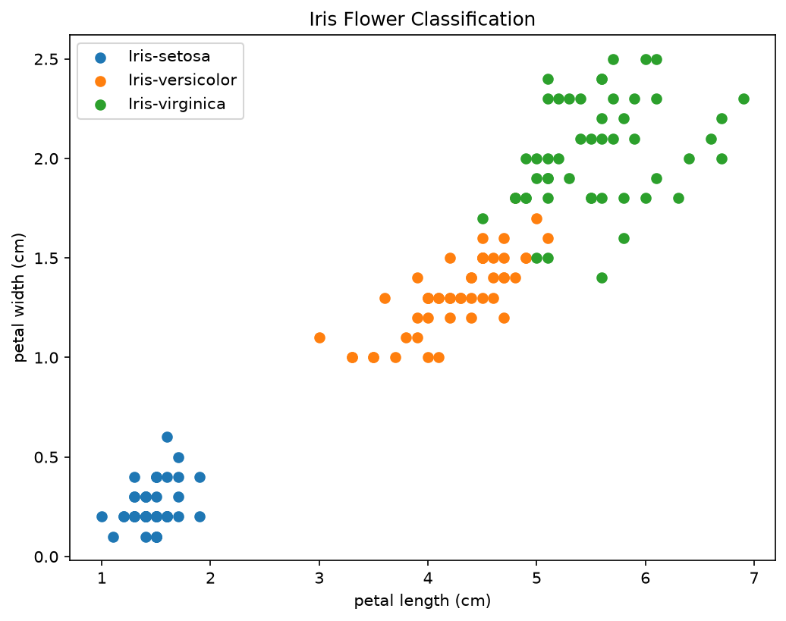
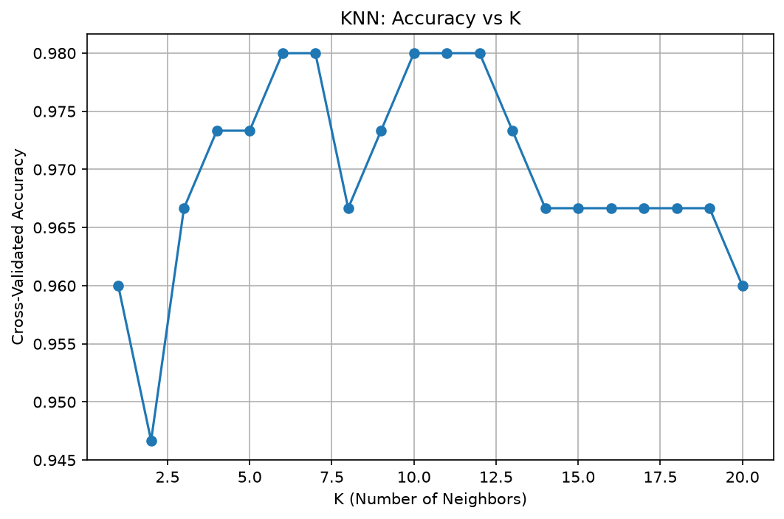
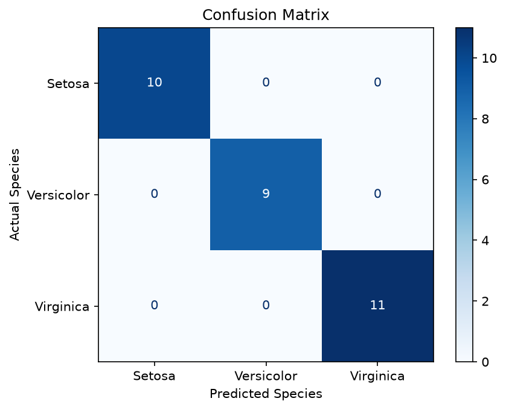

# Iris Flower Classification

Internship project (CodeAlpha) — training a K-Nearest Neighbors model to classify Iris flowers into three species based on sepal and petal measurements.

## Dataset
- Source: Iris.csv (150 samples, 3 species: Setosa, Versicolor, Virginica)
- Features: Sepal Length, Sepal Width, Petal Length, Petal Width

## Approach
1. Data cleaning (checked for missing values/duplicates)
2. Feature scaling with StandardScaler
3. Used 5-fold cross-validation to find the optimal K (1–20)
4. Trained final KNN model with best K
5. Evaluated with confusion matrix and classification report

## Results
- **Best K:** 6
- **Cross-validated accuracy:** 98.00%
- **Final test accuracy:** 100.00%

| Species | Precision | Recall | F1-score | Support |
|---------|-----------|--------|----------|---------|
| Iris-setosa | 1.00 | 1.00 | 1.00 | 10 |
| Iris-versicolor | 1.00 | 1.00 | 1.00 | 9 |
| Iris-virginica | 1.00 | 1.00 | 1.00 | 11 |

Full report: [results/classification_report.csv](results/classification_report.csv) · [results/classification_report.txt](results/classification_report.txt)

> Note: Iris is a small, well-separated dataset, so very high accuracy is expected and doesn't necessarily reflect performance on noisier real-world data.

## Visualizations

**Petal Length vs Width**


**Accuracy vs K**


**Confusion Matrix**


## Project Structure
```
CodeAlpha_IrisFlowerClassification/
├── dataset/                 # Iris.csv
├── images/                  # Saved plots
├── results/                 # Classification report (txt + csv)
├── IrisFlowerClassification.py
├── requirements.txt
└── README.md
```

## How to run
```
pip install -r requirements.txt
python IrisFlowerClassification.py
```

## Author
Siyolise Mbadu — CodeAlpha Internship